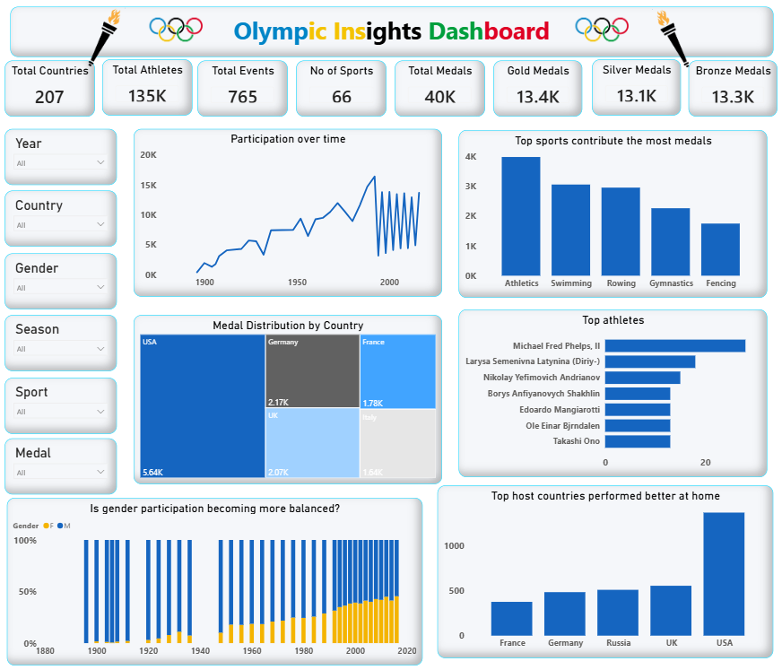

# 🏅 Olympic Data Analysis

A Power BI dashboard project that analyzes over a century of Olympic history to uncover trends in athlete participation, medal distribution, country performance, and gender representation.

---

## 📖 Overview

This project analyzes historical Olympic data using **Power BI**. The dataset was sourced from Kaggle and contains athlete-level records from multiple Olympic Games.

The project was initially started as part of my Power BI learning journey and later enhanced independently by performing exploratory analysis, creating interactive visualizations, and deriving meaningful business insights.

This project demonstrates my skills in:

- Data Cleaning using Power Query
- Data Modeling
- DAX Calculations
- Dashboard Design
- Data Visualization
- Business Insight Generation

---

## 📂 Dataset

- **Source:** Kaggle
- **Rows:** 271,116
- **Columns:** 15
- **Project Duration:** 4 July 2026 – 6 July 2026

---

## 📊 Dashboard Features

- KPI Cards
- Interactive Filters (Year, Country, Gender, Season, Sport, Medal)
- Participation Trend Analysis
- Medal Distribution by Country
- Top Performing Sports
- Top Olympic Athletes
- Gender Participation Trend
- Host Country Performance Analysis

---

## 🔍 Key Insights

### 1. Olympic participation has grown steadily over time

- Athlete participation has increased significantly since the first modern Olympic Games, reflecting the global expansion of the Olympics.
- Participation appears to fluctuate after 2000 because the dataset includes both **Summer** and **Winter Olympics**, and Winter Olympics naturally have fewer athletes.

---

### 2. Athletics contributes the highest number of medals

- Athletics is the most medal-contributing sport in Olympic history.
- It has been featured in **29 Olympic editions** and includes the highest number of medal events, creating more opportunities for athletes to win medals.

---

### 3. USA is the most successful Olympic nation

- The **USA** has won the highest number of Olympic medals.
- Approximately **90%** of its medals were earned in the **Summer Olympics**.
- The USA has participated in **35 Olympic Games**, one of the highest participation counts among all countries.

**Medal Composition**

- 🥇 Gold: **46.7%**
- 🥈 Silver: **29.1%**
- 🥉 Bronze: **24.2%**

---

### 4. Michael Phelps is the most decorated Olympian

- **Michael Fred Phelps II** has won the highest number of Olympic medals among all athletes.
- He has earned **28 Olympic medals**, including **23 Gold medals**, making him the most successful Olympian in the dataset.

---

### 5. Home advantage may influence medal performance

- The **USA** has hosted the Olympic Games **seven times** (1904, 1932, 1960, 1980, 1984, 1996, and 2002), the highest among all countries in the dataset.
- Hosting the Olympics may contribute to stronger medal performances through familiar venues and home crowd support.
- However, the USA's consistent success is also supported by its long participation history and large athlete delegation.

---

### 6. Gender participation has become more balanced over time

- Early Olympic Games were overwhelmingly male-dominated.
- Female participation has steadily increased across successive Olympic editions.
- Recent Olympic Games show a much more balanced gender representation, highlighting the Olympics' progress toward greater inclusivity.

---

## 🛠️ Tools & Technologies

- Power BI
- Power Query
- DAX
- Git
- GitHub

---

## 📁 Project Structure

```
Olympic_Dataset_Analysis/
│
├── data/
│   └── Raw datasets
│
├── olympic_dashboard.pbix
├── dashboard_screenshot.png
└── README.md
```

---

## 📸 Dashboard Preview




---

## 👨‍💻 Author

**Achyut Bhardwaz**

- GitHub: https://github.com/AchyutBhardwaz
- LinkedIn: https://www.linkedin.com/in/achyut-bhardwaz/

---

## ⭐ If you found this project helpful, consider giving it a star!
